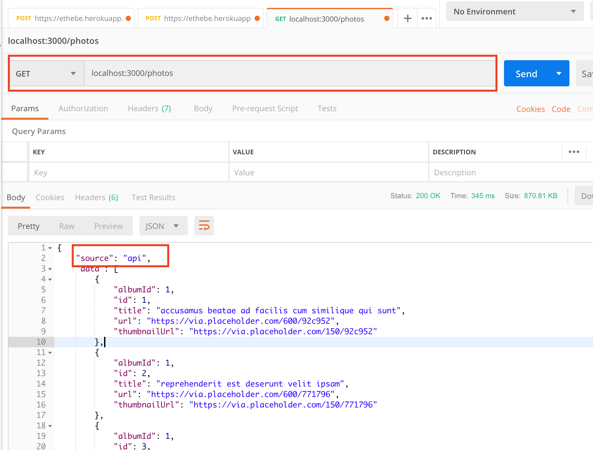
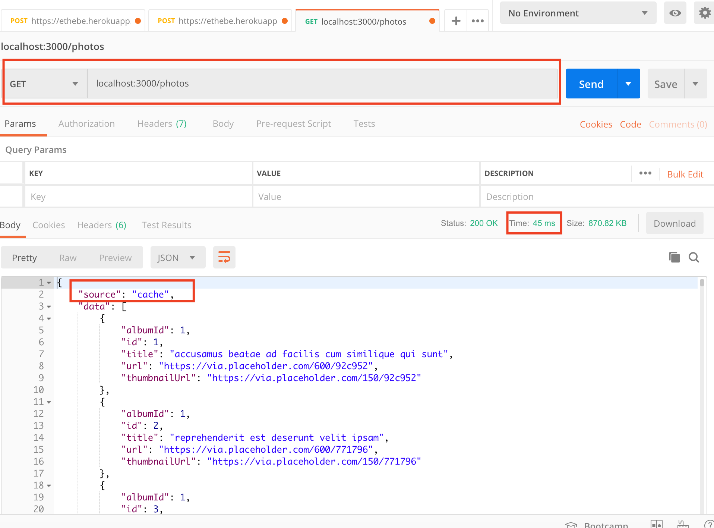

# Redis Nodejs Caching
This is a demo project to illustrate caching API calls in NodeJS (Express) using Redis in-memory data store. In its simplest 
form, an API call is made to an API endpoint ``/photos`` to retrieve a list of photos. For each request, Express server queries 
Redis for any cached request using a unique key. If the key exists Express loads the photos from Redis otherwise fetches the results from a remote Server.

## Prerequisites
Install the following to get started:

* NodeJS (https://nodejs.org/en/download/)
* Redis (https://redis.io/download)
* Postman (https://www.getpostman.com/downloads/)

## Setup
Start the development server by:

```
$ node server.js
```

Using Postman, visit http://localhost:3000/photos. The first request will take longer time, as data is being pulled from 
a remote Server. See below the comparison of the Remote and Redis requests:

### Remote Request:

Request takes 345 milliseconds.




### Redis Request:

Request takes 45 milliseconds

     
## Updating Cache
When saving data to Redis programmatically one can define the duration in seconds when the copy of data should be 
considered expired thus discarded automatically. In this application, this time has been set to 3600 seconds (1 hour) meaning if 
a user makes an API call after 1 hour the data will be re-cached.

## License
```
MIT License

Copyright (c) 2019 Mr Mod

Permission is hereby granted, free of charge, to any person obtaining a copy
of this software and associated documentation files (the "Software"), to deal
in the Software without restriction, including without limitation the rights
to use, copy, modify, merge, publish, distribute, sublicense, and/or sell
copies of the Software, and to permit persons to whom the Software is
furnished to do so, subject to the following conditions:

The above copyright notice and this permission notice shall be included in all
copies or substantial portions of the Software.

THE SOFTWARE IS PROVIDED "AS IS", WITHOUT WARRANTY OF ANY KIND, EXPRESS OR
IMPLIED, INCLUDING BUT NOT LIMITED TO THE WARRANTIES OF MERCHANTABILITY,
FITNESS FOR A PARTICULAR PURPOSE AND NONINFRINGEMENT. IN NO EVENT SHALL THE
AUTHORS OR COPYRIGHT HOLDERS BE LIABLE FOR ANY CLAIM, DAMAGES OR OTHER
LIABILITY, WHETHER IN AN ACTION OF CONTRACT, TORT OR OTHERWISE, ARISING FROM,
OUT OF OR IN CONNECTION WITH THE SOFTWARE OR THE USE OR OTHER DEALINGS IN THE
SOFTWARE.
```
